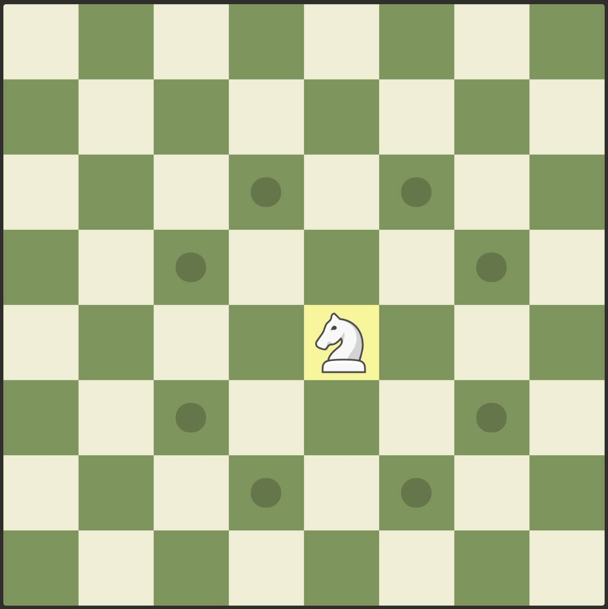
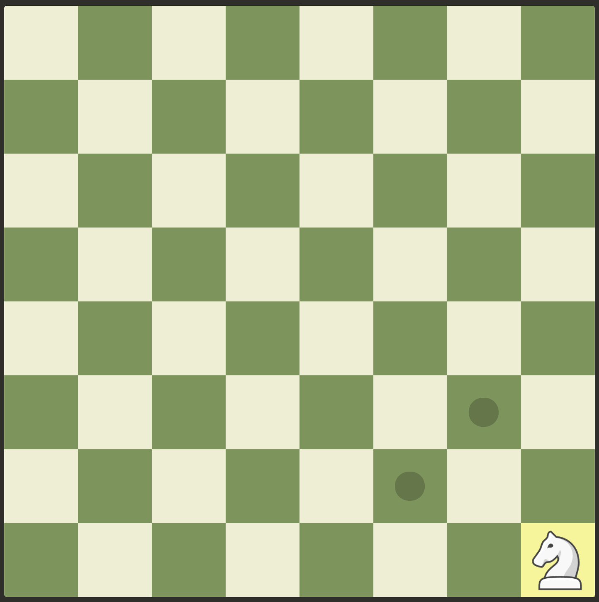

Three months ago I started playing chess. I play mostly blitz games on [chess.com](chess.com), in which each player has 5 minutes total to make all their moves. Get checkmated or run out of time before your opponent, and you lose.

Chess has an [Elo rating system](https://en.wikipedia.org/wiki/Elo_rating_system), which is a way of comparing the relative skill levels of different players. After my first 100 games I checked my rating and learned that I was in the 2nd percentile. In case you interpreted that as meaning that I was in the top 2% of players, you are wrong: I was in the *bottom* 2%, with an Elo rating of about 500. This was a motivating discovery.

I read in an online forum that in America you'll say you play chess if you know how the little horsies move, whereas in Russia you don't say you play chess unless your Elo rating is above 1500 (around the 85th percentile). Well, I'm Canadian, so now that my rating has climbed to hover around 1000 (40th %ile), perhaps I can get away with it: I play chess. Having now played over 1000 blitz games, it's time to share a few things I've learned.

**_My blitz rating on chess.com over 3 months and 1000 games_**

### 1. Look for check

Chess.com has a feature called Tactings Training. You are presented with a board state somewhere in the middle of a game, and you have to find the best move. Something that becomes very clear if you train tactics as a beginner is that the best move is almost always one that puts your opponent in check.

The example below shows a tactics puzzle I came across recently. Black's king moves to d7, and it's white to move. See if you can figure out the best move, and then click the right arrow to see whether you were right.

<!-- blank line -->

<figure class="video_container">
  <iframe border="0" frameborder="0" allowtransparency="true" width="603" height="465" src="//www.chess.com/emboard?id=5958016"></iframe>
</figure>
<!-- blank line -->

Your first instinct is probably to capture black's queen on f3. However, there is an even better move: queen to d6 check, supported by the knight on b5. From here, black has only two options: king to c8 or king to e8. Unfortunately for black, both moves lead to checkmate. In this case, black moves the king to c8,  followed by queen to c7 checkmate. If black had moved the king to e8, white could have responded with knight to c7 checkmate.

This example illustrates the importance of always looking for check, even when you have other good options. Conversely, you should be wary of being put into check yourself. The reason is simple: when you're in check, your options shrink tremendously. Your only asset in chess is your freedom to move pieces, so it's critical to preserve that freedom for yourself and take it away from your opponent as much as possible.

### 2. Control the center

Pieces in the center of the board control a larger number of squares. For example, when a knight is placed on one of the four center squares, it can move to eight squares around it. By contrast, if that same piece is placed in a corner, it only controls two squares.

The center is powerful             |  The edges are weak
:-------------------------:|:-------------------------:
  |  

In general, but especially early in the game, it's important to control as much of the center as possible, for the same reason to be constantly looking for check: it gives you more freedom to move your pieces.

### Castle early, and prevent your opponent from doing so

One thing that puzzled me during my first six weeks or so was that my opponent would often take the opportunity to trade queens with me very early on, before either of us had moved them. The reason for this only became clear after it had happened to me many times: by forcing your opponent to recapture your queen with their king, you prevent them from castling. In the game below, you can see me (as black) using this exact strategy on my opponent.

<!-- blank line -->

<figure class="video_container">
  <iframe border="0" frameborder="0" allowtransparency="true" width="603" height="465" src="//www.chess.com/emboard?id=5998166"></iframe>
</figure>

<!-- blank line -->

In almost all games between very good players, both castle their kings within the first ten moves or so. Usually earlier. One reason for this is that an uncastled king is closer to the center, which makes it more vulnerable. The other main reason is that the two rooks are more powerful when they are connected to each other, because it means they can defend each other. Once all other minor pieces have been developed, castling is the fastest way to connect the rooks.

### Develop, develop, develop

When I played chess as a kid, I played far too defensively. I reasoned that knights and bishops should be preserved for later in the game, and that most moves in the opening should be made with pawns. It took only about a dozen blitz games to show me what a mistake this is. 

By failing to develop minor pieces (knights and bishops) as quickly as possible, you cede much of the center of the board to your opponent, thereby losing a lot of control. 

After about a week of playing, I watched Daniel Rensch's excellent video series, [Everything You Need to Know About Chess](https://www.youtube.com/watch?v=21L45Qo6EIY&list=PLD63FA8DDC8874CDF), where I saw the position below described as an ideal position to aim for in the opening. This only lasts so long before you encounter opponents who know how to defender well against this exact sequence of moves, but at least for the first month or so, it's a great first step. All pieces either occupy or control central squares, and the king is safely stowed away in the corner.

<!-- blank line -->

<figure class="video_container">
  <iframe border="0" frameborder="0" allowtransparency="true" width="603" height="465" src="//www.chess.com/emboard?id=5997956"></iframe>
</figure>

<!-- blank line -->

### Don't leave pieces undefended

### Look for forks, pins, and skewers

### Seek trades when you're winning; avoid them when you're losing

### Spoil your opponent's pawn structure, and preserve your own

### Use your opponent's time for strategizing, and your own for tactics

### See the future by counting pieces that control key squares